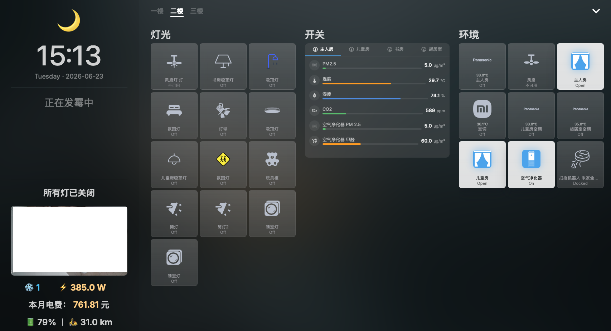
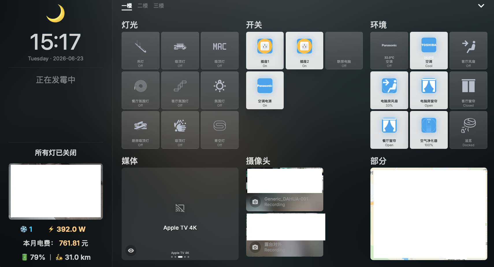

# ha-fusion (Custom Edition)

A modern, easy-to-use and performant custom [Home Assistant](https://www.home-assistant.io/) dashboard.

**This is a customized and optimized fork of the original ha-fusion project.**

<p align="center">
  
  
</p>

---

## ✨ Features & Enhancements in this Fork

This version includes significant improvements, new features, and bug fixes over the original repository:

- **Square Card (MapCard)**: Added support for displaying proportional square cards on the frontend, along with a dedicated UI configuration panel.
- **Sensor Group Template**: Allows grouping and displaying data from multiple sensors within a single card, significantly improving dashboard information density.
- **Enhanced Template Support**: Optimized and expanded the parsing capabilities for custom dashboard templates.
- **Codebase Health**: Fixed missing TypeScript type definitions (e.g. `LovelaceItem`), resolved compilation/rendering crashes caused by uninitialized variables and event binding issues, and executed a global Prettier formatting for better code maintainability.

---

## 🚀 Installation & Deployment

### 1. Docker Compose (Recommended for NAS / Standalone)

Deploying via Docker standalone is the best way to get a Progressive Web App (PWA) experience. You can open it in Safari on your iPad and tap "Add to Home Screen" for a seamless, full-screen dashboard without the Home Assistant companion app frame.

Create a `docker-compose.yml` file on your NAS or server:

```yaml
version: '3'
services:
  ha-fusion:
    container_name: ha-fusion
    image: ghcr.io/xiehe1250/ha-fusion:latest
    restart: always
    ports:
      - "5050:5050"
    environment:
      - TZ=Asia/Shanghai
      - HASS_URL=http://YOUR_HA_IP:8123   # Replace with your Home Assistant local IP
    volumes:
      - ./data:/app/data
```

Run the container:
```bash
docker-compose up -d
```

### 2. Docker CLI

If you prefer the command line over Docker Compose:

```bash
docker run -d \
  --name ha-fusion \
  --network bridge \
  -p 5050:5050 \
  -v /volume1/docker/ha-fusion/data:/app/data \
  -e TZ=Asia/Shanghai \
  -e HASS_URL=http://YOUR_HA_IP:8123 \
  --restart always \
  ghcr.io/xiehe1250/ha-fusion:latest
```

### 3. Home Assistant Add-on

If you prefer installing it inside Home Assistant via the Add-on Store:
1. In Home Assistant, go to **Settings > Add-ons > Add-on Store**, click the three dots in the top right corner, and select **Repositories**.
2. Paste **this repository's URL**: `https://github.com/xiehe1250/ha-fusion` and click Add.
3. Refresh the page, search for "Fusion (Custom Edition)", install and start it!

---

## 🛠 Query strings

These will only function if you have exposed a port in the add-on configuration or by using Docker. Note that when using Ingress, query strings cannot be read.

### View
To set a particular view when the page loads, add the "view" parameter. For example, if you have a "Bedroom" view, append the query string `?view=Bedroom` to the URL.

### Menu
To disable the menu button, append the query string `?menu=false` to the URL. This is useful when you want to avoid unwanted changes to your dashboard, such as on wall-mounted tablets.

---

## ⌨️ Keyboard Shortcuts

| Key                 | Description |
| ------------------- | ----------- |
| **f**               | filter      |
| **esc**             | exit        |
| **cmd + s**         | save        |
| **cmd + z**         | undo        |
| **cmd + shift + z** | redo        |

---

## 💻 Develop

To begin contributing to the project, you'll first need to install node and pnpm.

```bash
# prerequisites (macos)
brew install node pnpm

# install
git clone https://github.com/xiehe1250/ha-fusion.git
cd ha-fusion
pnpm install

# environment
cp .env.example .env

# server
npm run dev -- --open
```
